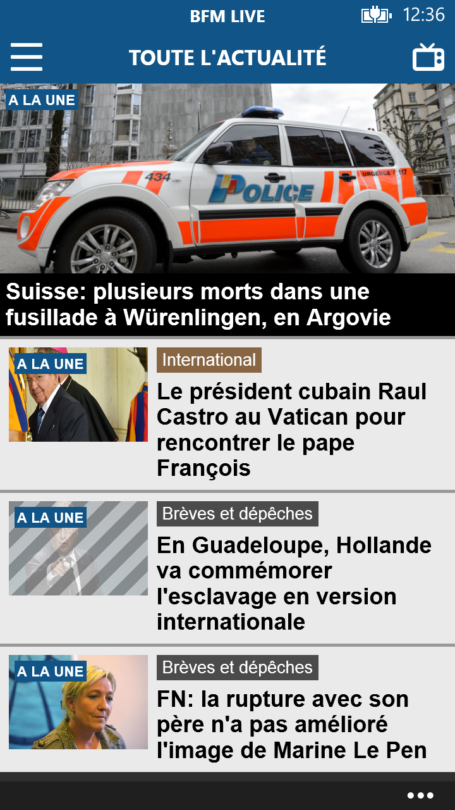
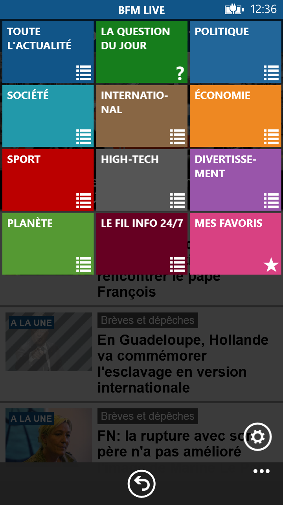
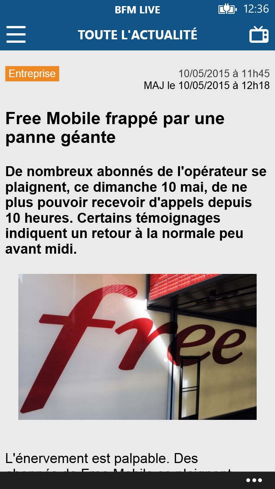

# Application BFM Live pour Windows Phone et Windows Mobile 10

A la suite de la fermeture du Store pour Windows 10 - je publie mes applis au cas où cela serait utile à quelqu'un.

L'application sur le store : [BFM Live](https://www.microsoft.com/store/apps/9WZDNCRD2BQW).

### Raison du projet

Cette application avait pour but de pouvoir accéder aux news de BFM depuis un Windows Phone.

### Description sur le store

```console
Toute l’actualité en France et à l’international, rubrique par rubrique avec l’application BFM Live.
```

### Ouverture du projet

```console
Utilisez Microsoft Visual Studio 2013 avec le SDK Windows Phone 8.1
```

### Quelques captures

<p align="center">
 </br>
 
 &nbsp;
 
 &nbsp;
 
</p>